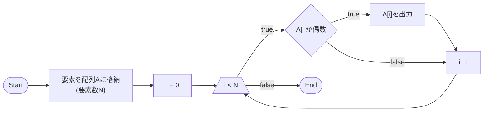
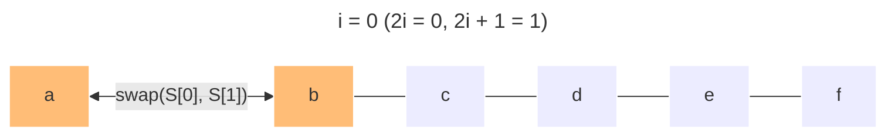
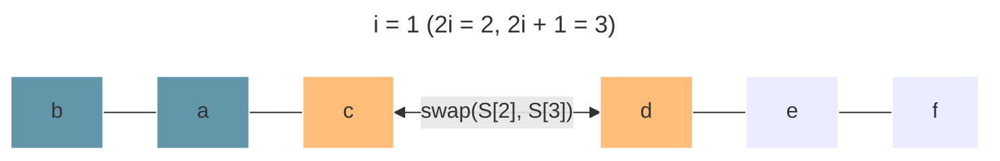
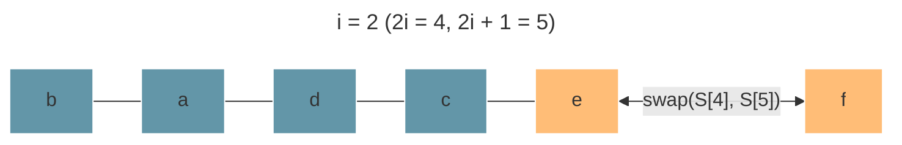
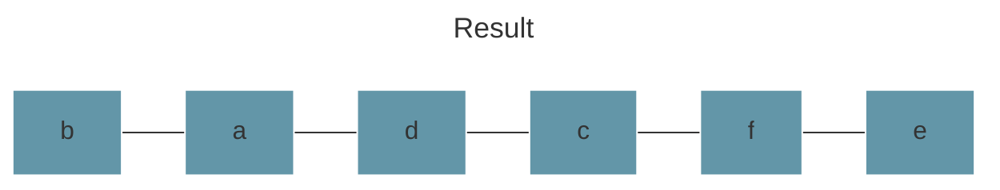
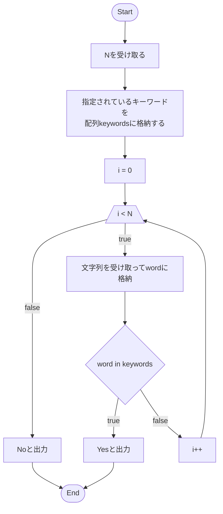

# 第3回 入門講習会
今回は過去の講習の復習をします。

## ABC294: A - Filter
<https://atcoder.jp/contests/abc294/tasks/abc294_a>

### 問題文

長さ $N$ の整数列 $A = (A_1,\ A_2,\ ...\ ,\ A_N)$ が与えられます。

$A$ から偶数だけすべて取り出し、もとの順番を保って出力してください。

### 制約
- $1 \leq N \leq 100$
- $1 \leq A_i \leq 100\ (1 \leq i \leq N)$
- $A$ には1つ以上の偶数が含まれる
- 入力はすべて整数

### 入力
入力は以下の形式で標準入力から与えられる。

---

$N$ \
$A_1\ A_2\ ...\ A_N$

---

### 出力
$A$ から偶数を取り出した列を、空白区切りで1行に出力せよ。

### ヒント
`for`文を使い、 $A_1,\ A_2,\ ...,\ A_N$ を順番に調べてみる。

### 解答例
簡易的なフローチャートと、実際のプログラムは以下の通りです。



```cpp
#include <bits/stdc++.h>
using namespace std;

int main() {
    int N; cin >> N;    // Nを受け取る

    vector<int> A(N);   // 長さNの配列を用意する

    // A_1, A_2, ..., A_NをAに格納する
    for (int i = 0; i < N; i++) cin >> A[i];

    for (int i = 0; i < N; i++) {
        // A[i]を2で割った余りが1なら(つまり奇数なら)飛ばす
        if (A[i] % 2) continue;
        
        cout << A[i] << " ";
    }

    cout << endl; // 最後に改行を出力する
}
```

`rep`マクロを使用すると、もう少しコンパクトに書けます:

```cpp
#include <bits/stdc++.h>
// #define ... の行を追加
#define rep(i, n) for (int i = 0; i < (int)(n); i++)
using namespace std;

int main() {
    int N; cin >> N;
    
    vector<int> A(N);
    rep(i, N) cin >> A[i];

    rep(i, N) {
        if (A[i] % 2) continue;
        cout << A[i] << " ";
    }
    cout << endl;
}
```

## ABC293: A - Swap Odd and Even
<https://atcoder.jp/contests/abc293/tasks/abc293_a>

### 問題文

英小文字からなる長さが偶数の文字列 $S$ が与えられます。 

$i = 1,\ 2,\ ...,\ \frac{|S|}{2}$ の順に以下の操作を行い、全ての操作を終えた後の $S$ を出力してください。
- $S_{2i-1}$ と $S_{2i}$ を入れ替える

### 制約
- $S$ は英小文字からなる長さが偶数の文字列
- $1 \leq |S| \leq 100$ ( $|S|$ は文字列 $S$ の長さ)

### 入力
入力は以下の形式で標準入力から与えられる。

---

$S$

---

### 出力
答えを出力せよ。

### ヒント
- 文字の入れ替えには`swap`関数を用いる
- 先頭の文字が`S[0]`に対応する
- `for`ループを回す際、 $i$ が0と1のどちらからカウントされるのかをしっかりと追う
  - $i = 0$ のとき $2i - 1 = -1$ になってしまう

### 解答例
`S = "abcdef"`のとき、 $\frac{|S|}{2}= 3$ です。問題で指示されている操作を図示すると、以下のようになります。

ただし、 $i = 0,\ 1,\ 2$ であることに注意してください。









- $i = 1,\ 2,\ ...,\ \frac{|S|}{2}$ に対して、 $S_{2i-1}$ と $S_{2i}$ を入れ替る
- $i = 0,\ 1,\ ...,\ \frac{|S|}{2} - 1$ に対して、 $S_{2i}$ と $S_{2i + 1}$ を入れ替る

これらの操作の違いは、 $S$ の1文字目を1から数えているか、あるいは0から数えているかということだけで、行っていることは変わりません。

```cpp
#include <bits/stdc++.h>
#define rep(i, n) for (int i = 0; i < (int)(n); i++)
using namespace std;

int main() {
    string S; cin >> S;
    
    rep(i, S.size() / 2) swap(S[2 * i], S[2 * i + 1]);
}
```

## ABC295: A - Probably English
<https://atcoder.jp/contests/abc295/tasks/abc295_a>

### 問題文

英小文字からなる $N$ 個の文字列 
$W_1,\ W_2,\ ...,\ W_N$
が与えられます。

これらのうち一つ以上が`and`, `not`, `that`, `the`, `you`  のいずれかと一致するなら`Yes` 、そうでないなら`No`と出力してください。

### 制約
- $N$ は1以上100以下の整数
- $1 \leq |W_i| \leq 50$
- $W_i$ は英小文字からなる

### 入力
入力は以下の形式で標準入力から与えられる。

---

$N$ \
$W_1\ W_2\ ...\ W_N$ 

---

### 出力
答えを出力せよ。

### ヒント
- 文字列 $W_1,\ W_2,\ ...,\ W_N$ を受け取る処理は、`vector<string>`型である配列を作って、`for`文で受け取ることで実装できる
- キーワードの配列を作っておくと、単語を検証する処理の実装が楽になる    

### 解答例
この問題は、 $N$ 個の単語に対して5つの単語のどれかと合致するか判定することを繰り返す問題です。

`for`文の中に`if`文を5つ並べても実装できます:

```cpp
#include <bits/stdc++.h>
#define rep(i, n) for (int i = 0; i < (int)(n); i++)
using namespace std;

int main() {
    // 入力の処理
    int N; cin >> N;

    bool has_keyword = false;

    rep(i, N) {
        // Wを受けとる
        string word; cin >> word;
    
        if (word == "and") has_keyword = true;
        if (word == "not") has_keyword = true;
        if (word == "that") has_keyword = true;
        if (word == "the") has_keyword = true;
        if (word == "you") has_keyword = true;
    }

    if (has_keyword)
        cout << "Yes" << endl;
    else
        cout << "No" << endl;
}
```

実は、もう少し簡単な方法として、「`if`文の中で変化するものだけを配列に入れて`for`文を回す」というものがあります。

簡易的なフローチャートは以下の通りです:


```cpp
#include <bits/stdc++.h>
#define rep(i, n) for (int i = 0; i < (int)(n); i++)
using namespace std;

int main() {
    // 入力の処理
    int N; cin >> N;

    // キーワードの配列を作っておく
    vector<string> keywords = {
        "and", "not", "that", "the", "you"
    };

    rep(i, N) {
        // Wを受けとる
        string word; cin >> word;
    
        // wordがkeywordsに含まれているか検証したい
        // wordに対して、keywordsの5要素をチェック
        rep(j, keywords.size()) {
            if (word == keywords[j]) {
                cout << "Yes" << endl;
                return 0;   // プログラムを終了
            }
        }
    }
    // Yesと出力されなかったときにNoと出力する
    cout << "No" << endl;

}
```

また、範囲`for`(Range-based `for`)文を使うと、楽にコーディングできることがあります:

```cpp
#include <bits/stdc++.h>
#define rep(i, n) for (int i = 0; i < (int)(n); i++)
using namespace std;

int main() {
    int N; cin >> N;

    vector<string> keywords = {
        "and", "not", "that", "the", "you"
    };

    rep(i, N) {
        string word; cin >> word;

        // 範囲for文を使ってみる
        // keywordsの要素が、前から1つずつkeywordに代入される
        for (string keyword : keywords) {
            if (word == keyword) {
                cout << "Yes" << endl;
                return 0;
            }
        }
    }

    cout << "No" << endl;

}
```
`for (string keyword : keywords)`と書くことにより、
`keyword = "and", "not", "that", "the", "you"`と代入されていきます。

## ABC292: A - CAPS LOCK
<https://atcoder.jp/contests/abc292/tasks/abc292_a>

### 問題文
英小文字のみからなる文字列 $S$ が与えられます。

$S$ の各文字を英大文字に変換して得られる文字列 $T$ を出力してください。

### 制約
- $S$ は英小文字のみからなる、長さが1以上100以下の文字列

### 入力
入力は以下の形式で標準入力から与えられる。

---

$S$

---

### 出力
$T$ を出力せよ。

### ヒント
- 文字列 $S$ の長さは`S.size()`で取得できます。
- ある英小文字 $c$ (1文字)を英大文字に変換する処理は、C++では`toupper`関数を用いて以下のように書けます:
  
```cpp
//Cにcを大文字に変換したものを代入
char C = toupper(c);
```

- `string`型は足し算ができます
  - `S += "abc"`とすると、 $S$ の後ろに`"abc"`が追加されます
  - `S += 'a'`のように、1文字だけ(`char`型)追加することもできます

### 解答例
```cpp
#include <bits/stdc++.h>
#define rep(i, n) for (int i = 0; i < (int)(n); i++)
using namespace std;

int main() {
    string S; cin >> S;

    string T = "";  // 文字列Tを用意し、中身を空に初期化する
    rep(i, S.size()) T += toupper(S[i]);

    cout << T << endl;
}
```

## ABC291: A - camel Case
<https://atcoder.jp/contests/abc291/tasks/abc291_a>

### 問題文
英大文字および英小文字からなる文字列 $S$ が与えられます。

ここで、 $S$ のうちちょうど1文字だけが英大文字であり、それ以外は全て英小文字です。

大文字が $S$ の先頭から何文字目に登場するか出力してください。

ただし、 $S$ の先頭の文字を1文字目とします。

### 入力
入力は以下の形式で標準入力から与えられる。

---

$S$

---

### 出力
大文字が $S$ の先頭から何文字目に登場するかを、整数で出力せよ。

### ヒント
- ある文字 $c$ が英大文字であることは、`isupper`関数を使うことで判定できる:
```cpp
char c = 'A';
bool is_upper = isupper(c); // true
```

### 解答例
```cpp
#include <bits/stdc++.h>
#define rep(i, n) for (int i = 0; i < (int)(n); i++)
using namespace std;

int main() {
    string S; cin >> S;
    
    rep(i, S.size()) {
        // S[i]が大文字なら、if文の中身が実行される
        if (isupper(S[i])) {
            // iは0から数え始めているので、出力用に1から数え始めるように変換する
            cout << i + 1 << endl;
            return 0;   // 出力したらプログラムを終了する
        }
    }
}
```
