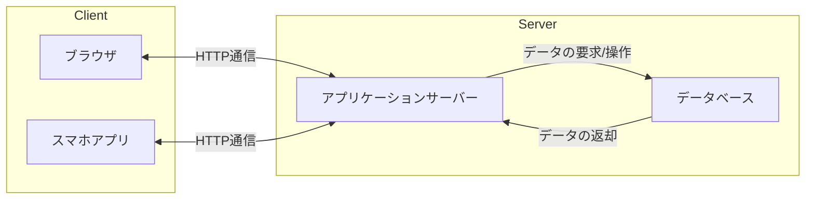

## はじめに

Webは知らないといけない知識がとても多く、挫折しやすい分野です。特に自分のレベルから上の技術に挑戦しようとすると、すぐに挫折してしまうことが多いです。
そのため、ぜひ技術を学ぶ際は最低限の動くものを作ることを目指して欲しいです。細かくステップアップしていくことが大切です。
それを積み重ねていくうちにより高度な技術を学ぶことができるようになると思います。
もし、Webの技術を学ぶ際に挫折したり、分からないことがあったら、ぜひWeb研のメンター（仮）の @sor4chi や @a01sa01to に聞いてください。いつでも歓迎します。

また、ガイダンスで**情報の多さ**がメリットだと言いましたが、逆に**情報の多さ**が答えに多様性を出してしまうため、複数のサイトをみて総合的に判断する必要があります。
そういうわけで、Web学習の最も大切な力は**調べる力**だと思っています。

## Webの分野

Webの分野はとても広く、Webアプリケーションを作る上で必要な知識はとても多いのですが全部やる必要はなく、自分の興味のある分野を選んで学んで欲しいなと思います。

| 分野 | やること | 楽しさ | 関連ある分野 |
| --- | --- | --- | --- |
| フロントエンド | UI/UXの実装、高速化 | ユーザーとの距離が近い | バックエンド、デザイン、インフラ（最近） |
| バックエンド | サーバーサイドの実装、データベースの設計、高速化 | データベースの設計など、競プロと関連が深い | フロントエンド、インフラ |
| インフラ | サーバーの構築、運用、監視、高速化 | サーバーの構築や運用など、システム全体の設計 | フロントエンド（最近）、バックエンド |
| デザイン | サイトのUI/UX、Flow、デザインシステム | UIだけじゃなくFlowやデザインシステムなど奥が深い | フロントエンド |
| プロダクトマネジメント | 進捗管理、用件定義、チームのマネジメント | ビジネスに一番近いIT分野、MTG駆動 | フロントエンド、バックエンド |

Web研では上記のどの分野も軽く触ってもらって、自分の興味のある分野を選んで学んでもらうことを目指しています。

ちなみに記者の私はフロントエンド寄りのフルスタックです。

## Webの技術

Webの技術のベースとなるのはやはり「通信」です。
やりとりにはプロトコルという通信のための約束事（規格）が必要で、Webでは主にHTTPというプロトコルを使います。HTTPは、後述のクライアントとサーバーの間で情報をやりとりするためのプロトコルです。
（ここでWebブラウザとサーバーを通信する仕組みと表現していないのは、スマホアプリなどWebブラウザを使わないWebアプリケーションもあるためです。）

:::details HTTP以外のWebのプロトコル
他にもWeb通信に使われるプロトコルとして、

- ファイルをネットワークを使ってやりとりするためのFTP
- メールをやりとりするためのSMTP
- チャットやゲームなどのリアルタイム通信をするためのWebSocket
- 通話や動画通話をするためのWebRTC

などがあります。
この講義では、アプリケーションを作る上でメインになるHTTPのみを扱います。
:::

## クライアントとサーバー

Webアプリケーションを作る上で、クライアントとサーバーに分けて考えることが多いです。
クライアントとはユーザーが直接触る部分のことで、Webブラウザやスマホアプリなどを指します。
一方サーバーとは、クライアントからのリクエストを受けて、レスポンスを返す部分のことで、Webサーバーやアプリケーションサーバーなどを指します。

図で説明するとこんな感じです



説明のために抽象化しているので、実際にはもっと構成が複雑ですが、このイメージがあれば大丈夫です。

今回はクライアントのうち、フロントエンドと呼ばれるWebブラウザを使った部分を扱います。

## Webブラウザ

ブラウザとは、Web上の情報を表示するためのソフトウェアです。
アプリケーションサーバーからのレスポンスを受け取り、HTMLやCSS、JavaScriptを解釈して画面に表示します。

## HTML

HTMLとは、Webページの骨組みを作るためのフォーマット記述言語です。（実はプログラミング言語ではありません）

実際にChromeだと検証から、他のブラウザでもDeveloper Toolsから実際に今表示されているサイトのHTMLを見ることができます。
（この行為を「検証する」や「インスペクトする」と言います）

### 書いてみよう

そのまえにまず作業用のディレクトリを作りましょう。
ユーザーフォルダの中に作りたいと思っています。
Windowsの場合は、`C:\Users\<ユーザー名>\Program\Maximum\Webken\1`、Macの場合は`/Users/<ユーザー名>/Program/Maximum/Webken/1`になります。
ただ、windowsでは`Users`フォルダが`ユーザー`という名前で表示されることがあるので、そこは注意してください。
作業ディレクトリを決まった場所に作ると、以前作ったものを見返したいという要望が出てきたときにとても便利です。つくったものはちゃんと整理しておきましょう。

以下のコードをエディタに貼り付けてindex.htmlという名前で保存してください。（ここではVSCodeというエディタをお薦めします。）

```html
<!DOCTYPE html>
<html>
  <head>
    <title>タイトル</title>
  </head>
  <body>
    <h1>見出し</h1>
    <p>段落</p>
  </body>
</html>
```

そして、このファイルをWebブラウザで開いてみましょう。
すると、以下のような画面が表示されるはずです。


実際に検証してみると


### HTMLの構造

HTMLは、タグというものを使って書きます。
タグとは、`<タグ名>中身</タグ名>`という形式で書きます。
この一つのまとまりをノードと呼びます。


この図のようにタグには属性というものを付けることができます。

また、HTMLは入れ子にすることができます。


入れ子にした時、そのタグを囲むタグを親要素、そのタグに囲まれたタグを子要素と呼びます。

Tips

- タグは大文字小文字を区別しません。基本は小文字で書きます。
- 親要素は必ず1つですが、子要素は複数持つことができます。
- タグで囲まれてない部分は、テキストと呼ばれます。これもノードの一種です。

### タグの種類

種類はめちゃくちゃあっていまだに自分も知らないタグに出会うこともあるので、ここではよく使うものを紹介します。
必要に応じて調べてみてください。

|タグ名|説明|
|---|---|
|`<html>`|HTMLのルート（一番親の）要素。必ず一番外側に書く。|
|`<head>`|ページの情報を書く。タイトルやCSSの読み込みなど、実際に画面上には表示されないものを書く。|
|`<body>`|ページの本文を書く。実際に画面上に表示されるものを書く。|
|`<h1> ~ <h6>`|見出しを書く。数字が大きいほど小さな見出しになる。|
|`<p>`|段落を書く。|
|`<a>`|リンクを書く。`href`属性にリンク先のURLを書く。|
|``|画像を表示する。`src`属性に画像のURLを書く。|
|`<div>`|ブロック要素を作る。何かを囲んだり、レイアウトを整えたりするのに使う。|
|`<span>`|インライン要素を作る。何か（文字列など）を強調したり、レイアウトを整えたりするのに使う。|
|`<input>`|入力フォームを作る。`type`属性に入力フォームの種類を書く。|

ほかにもたくさんありますが、これだけでもかなりのことができます。

## パス

このあとHTML内でほかのファイルを呼び出す的なことをするのですが、その前に必要な「パス」について説明します。

パスとは、ファイルやディレクトリの場所を表す文字列です。
全てのファイルやディレクトリは一意のパスを持っており、それを使ってファイルやディレクトリを指定することができます。
いわゆる所在地や住所のようなものです。

### 絶対パスと相対パス

パスには絶対パスと相対パスがあります。

絶対パスとは、ルートディレクトリからのパスです。
ルートディレクトリとは、ファイルシステムの一番上のディレクトリです。
Windowsの場合は`C:\`、MacやLinuxの場合は`/`です。
ここからファイルやディレクトリを指定することで、そのファイルやディレクトリの場所を必ず特定することができます。
例えばデスクトップに`index.html`というファイルがあれば、`C:\Users\ユーザー名\Desktop\index.html`というパスで指定することができます。MacやLinuxの場合は`/Users/ユーザー名/Desktop/index.html`です。
さっき`index.html`をブラウザで開いたと思うんですが、その時にURLバーに表示されていた`file:///C:/.../index.html`の`C:/.../index.html`が絶対パスになっています。

相対パスとは、現在の場所からのパスです。
例えばこんなディレクトリ構造があったとします。

```txt
sample-website
├── index.html
└── images
    └── logo.png
```

このとき、`index.html`から`logo.png`を呼び出すには、`./images/logo.png`というパスを指定します。
`.`というのは、現在のディレクトリを表します。
`./images/logo.png`というのは、現在のディレクトリの中の`images`ディレクトリの中の`logo.png`という意味になります。
`./`は省略することができますが、基本は書いておくことをおすすめします。

次にこんなディレクトリ構造があったとします。

```txt
sample-website
├── site
│   └── index.html
└── images
    └── logo.png
```

このとき、`index.html`から`logo.png`を呼び出すには、`../images/logo.png`というパスを指定します。
`..`というのは、一つ上のディレクトリを表します。
`../images/logo.png`というのは、一つ上のディレクトリの中の`images`ディレクトリの中の`logo.png`という意味になります。

Tips

- ディレクトリの区切り文字は、Windowsの場合は`\`、MacやLinuxの場合は`/`です。
- `|`や`├──`などでディレクトリ構造を表現することがあります。
- ここでいう`path`は`file path`の略で、ファイルの場所を表す文字列のことです。
  - `file path`は今後使うであろう環境変数の`PATH`とは別物です。ややこしいですが、別物です...
- フォルダとディレクトリは同じ意味です。
  - ディレクトリの方がPC用語的には正しく、フォルダはWindowsのファイルエクスプローラーで主に使われている用語です。

## 外部ファイルの読み込み

一番簡単な画像の読み込みをしてみましょう。HTMLでは別URLの画像も、自分のパソコン内の画像も読み込むことができます。
適当なサイトの適当な画像を探して右クリック -> 「画像のURLをコピー」のような項目を選択して、画像のURLをコピーしておきましょう。

さっきの`index.html`に画像を表示するためのタグを追加します。

```html
<!DOCTYPE html>
<html>
  <head>
    <title>タイトル</title>
  </head>
  <body>
    <h1>見出し</h1>
    <p>段落</p>
    
  </body>
</html>
```

``タグは画像を表示するためのタグです。
`src`属性に画像のURLを指定することで、画像を表示することができます。

これで`index.html`をブラウザで開くと、画像が表示されるはずです。

Tips

- ``タグは``という形で書くことができます。
  - ``タグは空要素です。つまり、``と`</img>`のように開始タグと終了タグを書く必要がないタグです。

さて、自分が撮影した画像など、まだネットにアップしていない画像を表示したい場合はどうすればいいでしょうか。

`index.html`と同じディレクトリに好きな画像を置いてください。名前が長いと書くのが面倒なので自分は`image.png`という名前にしました。

次に``タグの`src`属性に画像のパスを指定します。

```html
<!DOCTYPE html>
<html>
  <head>
    <title>タイトル</title>
  </head>
  <body>
    <h1>見出し</h1>
    <p>段落</p>
    
  </body>
</html>
```

はい、ここででてくるのが相対パスです。
`./image.png`というのは、現在のディレクトリの中の`image.png`という意味になります。
`index.html`と画像ファイルがおなじディレクトリにあることを確認してから、ブラウザで開いてみてください。
どうでしょうか？パスをうまく指定できていれば画像が表示されるはずです。
もし表示されない場合は、パスを確認してみてください。

さらにファイルパスを整理しましょう。一つのサイトで複数の画像を使いたい場合、それを一つのディレクトリにまとめておくと便利です。`images`というディレクトリを作って、その中に`image.png`を移動してみましょう。

```txt
sample-website
├── index.html
└── images/
    └── image.png
```

`index.html`の``タグの`src`属性を`./image.png`から`./images/image.png`に変更してください。

```html
<!DOCTYPE html>
<html>
  <head>
    <title>タイトル</title>
  </head>
  <body>
    <h1>見出し</h1>
    <p>段落</p>
    
  </body>
</html>
```

これで画像が表示されるはずです。

## CSS

CSSは、HTMLの見た目を変更するための言語です。
CSSを使うことで、文字の色や大きさ、画像の大きさや位置などを変更することができます。

CSSはHTMLと同じように、`<style>`タグの中に書きます。

```html
<!DOCTYPE html>
<html>
  <head>
    <title>タイトル</title>
    <style>
      h1 {
        color: red;
      }
    </style>
  </head>
  <body>
    <h1>見出し</h1>
    <p>段落</p>
    
  </body>
</html>
```

先ほどまで黒色だった見出しが赤色になったと思います。
このように、`<style>`タグの中にCSSを書くことで、HTMLの見た目を変更することができます。

CSSは、`セレクタ { プロパティ: 値; }`という形で書きます。
`セレクタ`は、どの要素に対してCSSを適用するかを指定します。タグ名以外にも、`class`や`id`を指定することもできます。
`プロパティ`は、どのようなプロパティを変更するかを指定します。よく使うプロパティはこちらになります。

| プロパティ | 説明 |
| --- | --- |
| `color` | 文字の色を変更します。 |
| `background-color` | 背景色を変更します。 |
| `font-size` | 文字の大きさを変更します。 |
| `width` | 要素の横幅を変更します。 |
| `height` | 要素の縦幅を変更します。 |
| `margin` | 要素の外側の余白を変更します。 |
| `padding` | 要素の内側の余白を変更します。 |
| `border` | 要素の境界線を変更します。 |

`値`は、プロパティに対してどのような値を指定するかを指定します。

```html
<!DOCTYPE html>
<html>
  <head>
    <title>タイトル</title>
    <style>
      h1 {
        color: red;
      }
    </style>
  </head>
  <body>
    <h1>見出し</h1>
    <p>段落1</p>
    <p>段落2</p>
    <p>段落3</p>
    
  </body>
</html>
```

次に`<p>`タグを3つ追加してください。ここで、`<p>`タグの2つ目だけにCSSを適用してみます。

```html
<!DOCTYPE html>
<html>
  <head>
    <title>タイトル</title>
    <style>
      h1 {
        color: red;
      }
      .marker {
        background-color: yellow;
      }
    </style>
  </head>
  <body>
    <h1>見出し</h1>
    <p>段落1</p>
    <p class="marker">段落2</p>
    <p>段落3</p>
    
  </body>
</html>
```

`<p>`タグの2つ目に`class="marker"`という属性を追加しました。
`class`は複数の要素に同じCSSを適用したい場合に使います。
なので

```html
<!DOCTYPE html>
<html>
  <head>
    <title>タイトル</title>
    <style>
      h1 {
        color: red;
      }
      .marker {
        background-color: yellow;
      }
    </style>
  </head>
  <body>
    <h1 class="marker">見出し</h1>
    <p>段落1</p>
    <p class="marker">段落2</p>
    <p>段落3</p>
    
  </body>
</html>
```

こんな感じで別に異なるタグであっても同じCSSを適用することができます。

### Responsive

CSSには、画面のサイズによって見た目を変更することができる機能があります。
これを`Responsive`、それを使った画面サイズによって変わるデザインを`Responsive Design`と呼びます。

```html
<!DOCTYPE html>
<html>
  <head>
    <title>タイトル</title>
    <style>
      h1 {
        color: red;
      }
      .marker {
        background-color: yellow;
      }
      @media screen and (max-width: 600px) {
        h1 {
          color: blue;
        }
      }
    </style>
  </head>
  <body>
    <h1 class="marker">見出し</h1>
    <p>段落1</p>
    <p class="marker">段落2</p>
    <p>段落3</p>
    
  </body>
</html>
```

`@media screen and (max-width: 600px)`という記述は、画面の横幅が600px以下の場合にCSSを適用するという意味になります。
CSSは上から順番に適用されるので、より下に書いたCSSがOverrideされます。
そのため、この書き方だと画面サイズが600px以下の場合に`h1`の文字色が青色Overrideされます。

### 外部ファイル

CSSはHTMLの中に書くこともできますが、外部ファイルとして書くこともできます。
分けることでHTMLのファイル自体が肥大化せず、管理しやすくなります。
それでは`<style>`タグの中身を`./styles/main.css`というファイルに移動してみましょう。

```html
<!DOCTYPE html>
<html>
  <head>
    <title>タイトル</title>
    <link rel="stylesheet" href="./styles/main.css">
  </head>
  <body>
    <h1 class="marker">見出し</h1>
    <p>段落1</p>
    <p class="marker">段落2</p>
    <p>段落3</p>
    
  </body>
</html>
```

```css
h1 {
  color: red;
}
.marker {
  background-color: yellow;
}
@media screen and (max-width: 600px) {
  h1 {
    color: blue;
  }
}
```

`<link rel="stylesheet" href="./styles/main.css">`という記述で、`./styles/main.css`というファイルを読み込んでいます。
`<link>`タグは`<head>`タグの中に書きます。
これで、`./styles/main.css`の中身がHTMLに適用されます。

## まとめ

今回は、HTMLとCSSの基本的な使い方を学びました。情報を読み込み表示するという一連の流れを学びました。
次回は、JavaScriptを使ってサイトに動きをつけていきます。
